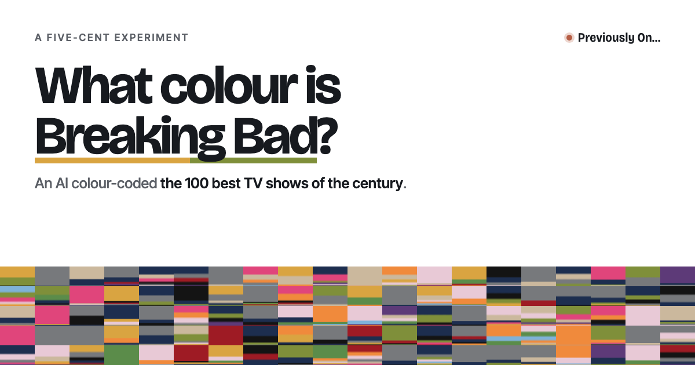

# Previously On…

**I asked Jev to associate one of 13 colours with each of 100 TV shows. These are the results.**

[previously-on-tv.vercel.app](https://previously-on-tv.vercel.app)



## What this is

The New York Times' 100 best TV shows of the 21st century, each given a colour by Jev, a decision model from TypeSafe AI. Every tile in the quilt is one show, drawn as bands sized by how likely Jev thought each colour was. I made it over a weekend as a portfolio piece. It's a non-commercial fan project.

## How I did it

For each show, I gave Jev its title, years, network, genres and TVmaze summary, and one question: *"Which colour best captures this TV show's mood, tone and visual world?"* I offered 13 colours, each with a short description I wrote, such as *"Deep reds: violence, danger, passion, power."*

Jev doesn't pick one answer. It returns a probability for every colour and a confidence score. *Breaking Bad* came back 55% desert gold and 41% sickly green, so its tile is split almost in half. A show Jev was sure about, like *RuPaul's Drag Race* (100% neon pink), is a single solid colour.

100 calls, about 78K tokens, about a third of a cent.

## What I learned from four more runs

After the quilt was done, I wanted to know how steady those answers were. Would Jev give the same quilt twice? What would move it?

I asked the same question four more times, changing one thing each time, and compared every answer with the original.

### Run 0: the same question again

I changed nothing. The answers moved about 3% on average, and no show moved more than 8%. Five shows swapped their top colour, but each was already a near tie.

**Jev wobbles a little, but not much. One run is enough.** Repeating and averaging wouldn't change the quilt in any way you could see.

### Run 2: new show descriptions

I replaced the TVmaze summaries with new ones, all about 50 words and written about mood and theme as well as plot. ChatGPT drafted them for me. The answers moved 16% on average, and 22 shows changed their top colour, the most of any run. *Justified* went from 34% to 87% desert gold once its description called it "a modern Western."

I expected single words to pull hard. They didn't. Fourteen descriptions mention "power," and blood red, whose description includes "power," barely moved. Jev also handled "not": *Twin Peaks: The Return* "resists the comforts of nostalgia," and pastel ("nostalgia") stayed at 0%.

**Jev reads a show's description for its whole meaning, not for keywords.**

### Run 3: the colours in a different order

I listed the 13 colours from darkest to lightest instead of my original order. The answers moved 9% on average, and 15 shows changed their top colour. Sure shows didn't move at all. Torn shows moved, but only between close colours, such as midnight blue and black.

**Order can tip a close call, but it can't change Jev's mind.** No order is neutral, though, including my original one.

### Run 4: new words for the colours

I rewrote all 13 colour descriptions and hid the colour names (Jev saw `colour_a` to `colour_m`). This moved the answers most: 18% on average, and up to 85%. Even shows Jev had been sure about moved.

*The Crown* went from 85% royal purple to 0%. My original purple said "royalty." My new one said "fantasy, eccentricity, mysticism, decadence." Without the word, purple had nothing to do with the show.

**Jev never sees a colour, only my words for it.**

### All four runs together

| Run | What I changed | Typical move | Shows that changed top colour |
|---|---|---|---|
| 0 | Nothing | 3% | 5 |
| 3 | The order of the colours | 9% | 15 |
| 2 | The show descriptions | 16% | 22 |
| 4 | The colour descriptions | 18% | 18 |

Some things held every time:

- **59 of the 100 shows kept the same top colour in all five runs.**
- **Sure shows stayed sure.** *RuPaul's Drag Race* was neon pink every time.
- **Torn shows moved.** A low confidence score is a fair warning that a tile could easily look different.
- **The quilt as a whole barely changed.** No colour gained or lost more than about 4 points of the quilt, and steel grey was the most common colour every time.

So the quilt on the site is one honest answer, not the only one. Jev chose the moods, and I chose the paint.

The four runs cost about $0.013 for 400 calls. The site still shows the original run.

## How it's built

```
shows.csv ──fetch_covers.py──▶ shows.json + covers/        (TVmaze API, no key)
                    ├──make_poster.py──▶ poster_covers.png
                    └──build_site_data.py──▶ site/shows.json + site/covers/
jev_colour.py ──▶ jev_cache/colour/ ──▶ site/jev/colour.json   (Jev, once)
jev_steady.py ──▶ jev_cache/colour_run{0,2,3,4}/               (the four extra runs)
```

- `shows.csv` is the ranking, transcribed from the NYT's printable checklist (`nyt-print-list.jpeg`).
- Every Jev response is cached on disk, so nothing is ever paid for twice. The site never calls Jev.
- The site is static (`site/index.html`, with no build step), deployed on Vercel from `main`.

Needs Python 3.10+ and Pillow. The Jev scripts read `TYPESAFE_API_KEY` from the environment or `.env`.

## Credits

By Mridhula. Ranking by The New York Times (2026). Cover art and summaries from [TVmaze](https://www.tvmaze.com). Colours by [Jev](https://typesafe.ai) from TypeSafe AI. The Run 2 descriptions were drafted with ChatGPT.

Cover art belongs to the studios and networks. This is a non-commercial fan project.
